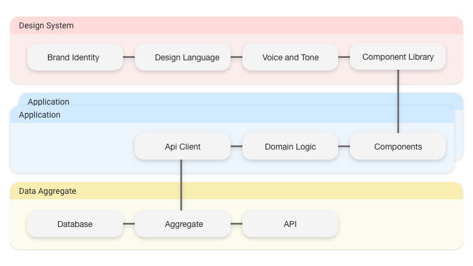

We so rarely talk about the front end in abstract terms. It's all _"how to x in React"_ or _"Scaling apps in my favourite framework"._

Let's take a moment and talk about how we could split up our front-end concerns on a higher level,
agnostic of any framework or technology, so that we can avoid distractions when dealing with the aforementioned challenges.

### The Front End

What is the front end?

It is my opinion that today's front-end developer should harness the skill to provide a user with a visual interface
to interact with the product one is working on. Be it a web application, a mobile app, a car's dashboard or a kitchen fridge.
This is inherently the job of the front-end developer.

We can safely assume that the front end can appear in many forms, sizes and places, and all these require their own unique
behaviour in order to fulfill the needs of our users.

As an organisation grows, it is almost certain that the product it provides will need to be presented in more than one of these
types of platforms. For example, a media streaming service will effectively want to be present in all of them,
perhaps even the fridge!

### Separation of concerns

Software architects often like to use layers to sort the different responsibilities of a program into distinct,
easy-to-reason-about chunks that can be stacked to form a hierarchy. I will attempt to do the same thing with what I believe
to be the chunks that a front end should consist of, so that we can maintain the same level of flexibility and productivity
across all the types of gadgets and gizmos that exist out there.

_**Quick disclaimer:** Perhaps these concepts can be sorted into something more pragmatic than layers,
the important part is the separation of concerns._

_An illustration of the Front End Layers_

#### Design system

As front-end developers, UI and UX designers we are responsible for the visual representation and interaction of our products.
What we present to our users should always be the number one concern of any front-end unit. Building a design system early
and sticking to it as if it was holy law is imperative to succeed in scaling your products.
The implications of what a design system is may vary but these are the assertions that I believe we should make about them.

1. The core of a design system should be reusable across products. A company's products don't have to look the same,
   but they should feel the same.
2. Component libraries should exist that strictly follow the rules of the design system.
3. A component library should not consume remote data directly.
4. A design system's documentation should be available to the public.

**Note:** Point 3 makes the layer approach a bit awkward, but I hope we can agree on the general philosophy.

#### Data aggregate

If we ever assumed that the backend team is only concerned delivering data to our front ends, this is no longer the case.
Backend developers building API's have their own group of stakeholders to worry about, integrators. This means that there will be
certain compromises in API design. Thus, having a middleware where we can create new datasets tailored
to the front end can prove quite useful.

A front end that does not communicate with a data source is a rare sight these days and I believe that the number of data points a
single client side application will have to interact with will only grow. A single resource in our front end might consist of
multiple different sources of data, so in order to reduce complexity in our application code, we will want to host an aggregate of the
data our front ends interact with so that we can simplify what our client will consume.

#### The application

This one might not come as a big surprise. This is the layer that separates a fridge from a smart watch.
But provided that we have the above layers, maintaining our applications should now be a less daunting task.
I had thought about splitting this up into a logic and view layer, but being a firm believer in colocation I feel that
sharing logic between applications is not something that needs to be asserted in order to succeed.
There are people out there far smarter than me that will deep dive into what makes a scalable front-end application.

Check out Kent C. Dodds' post on [Colocation](https://kentcdodds.com/blog/colocation) if you're interested in learning more about the principle.

### Practical examples

Contrary to my introductory statement, that this post is meant to provide a higher level overview of the types of lines we should be
drawing in our front-end architecture, I would like to shed a light on some concrete options that I would see myself reaching for to
follow this pattern.

#### Storybook

[Storybook](https://storybook.js.org/) is a great option for creating design systems, as they combine the elements of documentation
and component library in a very nice way. Storybook is framework agnostic but provides extensions for most of the more popular
libraries for building components. Whatever framework you choose to build your component library in probably comes down to where
your product makes the most impact.

In terms of the actual design system, this does not rely on a product or a technology.
I'm a big fan of [Atomic Design](https://bradfrost.com/blog/post/atomic-web-design/) as I think cleverly segments all the different
concerns of the front end.

#### Apollo

As of right now I don't know about any other option that provides the option of aggregating data and providing a more specified interface
for front ends, other than rolling your own of course. [Apollo](https://www.apollographql.com/) seems like a natural choice to me but
I wouldn't be surprised if there are more of them, and I find it highly likely that these types of services will be all the more common.

#### Whatever (Probably React)

There are just too many libraries and frameworks out there that all aim to suit different types of needs, therefore I think it's out of
the scope of this post to cover. It is always important to analyse what needs you or your organisation has before settling on a technology,
not to mention the developer culture and experience.

### Orchestration

Spreading these responsibilities into their own compartments might seem like it creates too much complexity.
But we have to remember that complex does not have to mean complicated. Utilizing container technology and tools like [Lerna](https://lerna.js.org/),
packing these concepts into a single deliverable can prove relatively simple. Of course, everything is always a trade off;
and we should only introduce the amount of complexity we believe we need to provide our users with great software.

### Review

Being a front-end developer in this day and age is an ever more complex role than it may have been perceived as just a few years ago.
The Front End is more or less everywhere in some shape making it ever more important to create these firm foundations so that we can
limit uncertaintywithin teams and among stakeholders.With that said it is likely that I will dive deeper into each of these layers
in future posts.

Now these are just my reflections on the subject. These concepts undoubtedly seem rather basic.
But perhaps that is why they are not as commonly discussed on the level of detail that they deserve.

Thanks for taking the time to read this. If you have thoughts on the subject don't hesitate to get in touch. Happy architecting!
