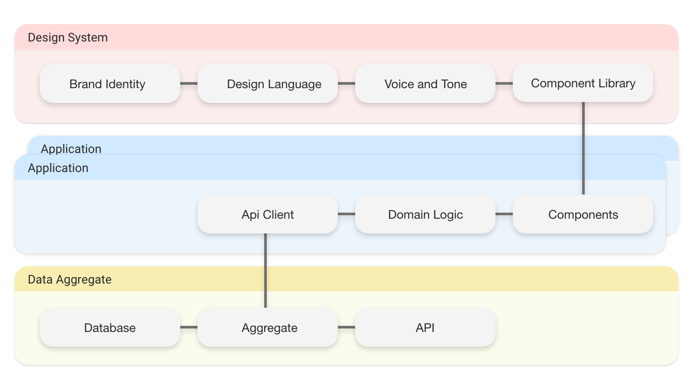

We so rarely talk about the front end in abstract terms. It's all _"how to x in React"_ or _"Scaling apps in my favourite framework"._ Let's take a moment and talk about how we could split up our front-end concerns on a higher level, agnostic of any framework or technology, so that we can avoid distractions when working on complex client side applications.

### The Front End

What is the front end?

If we as front-end developers are responsible for providing an individual with the means (the application) to interact with a digital product, it would be safe to assume that the front end is a result of that process. Be it a web application, a mobile app, a car's dashboard or a kitchen fridge. This is inherently the job of the front-end developer. With that said, the front end can appear in many forms, each of which introduces it's unique behaviour in order to fulfill the needs of our users.

As a team or organisation grows, it is almost certain that the product it provides will need to be presented in more than one of the aforementioned platforms. For example, a media streaming service will effectively want to be present in all of them, perhaps even the fridge!

For the past two years I have had the honor of working alongside some incredibly smart people breaking up a monolithic application into a front and a back end. During that time I have started identify some of they key elements of the front end. Reflecting on what I've learned I now feel confident to provide my perspective on what modern front-end architecture should look like.

### Separation of concerns

Software architects often like to use layers to sort the different responsibilities and dependencies of a program into distinct, easy-to-reason-about chunks that can be stacked to illustrate which pieces interact (or allowed to interact) with each other. Modelling our software in this way keeps it abstract so that even if it is technically complex, we know where the boundaries are, and then where to go to achieve a certain goal or fix a certain problem.

I will attempt to do the same thing with what I believe to be the chunks that a front end should consist of, so that we can maintain flexibility and productivity across all the types of gadgets and gizmos that exist out there.

_An illustration of the front-end layers_

Looking at the illustration above, it quickly bears a resemblance to a [three-tier architecture](https://en.wikipedia.org/wiki/Multitier_architecture). We have our typical data layer and we can assume the application layer handles our logic. Naturally the view layer should follow, where we would define our visual interface. But isn't this the front end? Aren't we already in the view layer? Why do we need more layers?! Well... As our interfaces have grown in interactive capabilities, so have they in complexity. It is therefore reasonable that eventually we are forced to break these larger individual layers into smaller ones so that we can continue developing and _scaling_ our products in a consistent manner.

It's time to start breaking up our interface concers, the buttons and carousels we've spent countless hours designing. But how do we scale design?

#### Design systems

Because we're attempting to create a succinct experience for people with all sorts of technical backgrounds or variations that cause them to approach our applications differently, we will have to stay consistent in the way that we present them.

As front-end developers, UI and UX designers we are responsible for the visual representation and interaction of our products. What we present to our users should always be the number one concern of any front-end unit. Building a design system early and sticking to it as if it was holy law is imperative to succeed in scaling our products. The implications of what a design system is may vary but these are the assertions that I believe we should make about them.

1. The core of a design system should be reusable across products. A company's products don't have to look the same,
   but they should feel the same.
2. Component libraries should exist that strictly follow the rules of the design system.
3. A component library should not consume remote data directly.
4. A design system's documentation should be available to the public.
5. The design system itself should not rely on any type of technology.

Spending time on defining a design system can be a hard sell, but companies often spend a lot of time and resources on defining it's culture and core values. A design system is a fantastic way of communicating these to our customers.

Brad Frost has become a bit of an evangelist of design systems. I highly recommend checking out his [blog](https://bradfrost.com/blog/) and even reading his book, Atomic Design.

#### The application

This one might not come as a big surprise. This is the layer that can separate a fridge from a smart watch. But provided that we have the other layers, maintaining our applications should be a less daunting task.
I had thought about splitting this up into a logic and view layer, but being a firm believer in colocation I feel that
sharing logic between applications is not something that needs to be asserted in order to succeed.

There are people out there far smarter than me willing to deep dive into what makes a scalable front-end application; so I won't linger on the subject. Kent C. Dodds' is one of those people. He even has a post on [Colocation](https://kentcdodds.com/blog/colocation)!

#### Data aggregate

If we ever assumed that the back-end team is only concerned with delivering data to our front ends, this is no longer the case. Back-end developers building API's have their own group of stakeholders to worry about, integrators. This means that there will be certain compromises in API design. Moreover, it is quite likely that we might have more than one codebase for the same application to suit different types of devices. Thus, having a middleware where we can create new datasets tailored to the front end can prove quite useful.

A single resource in our front end might consist of multiple different sources of data, so in order to increase reusability and reduce complexity in our application code, we will want to host an aggregate of the data our front end interacts with so that we can simplify what our applications will ultimately consume.

### Practical examples

Contrary to my introductory statement, that this post is meant to provide a higher level overview of the types of lines we should be drawing in our front-end architecture, I would like to shed a light on some concrete options that I would see myself reaching for in order to follow this pattern.

#### Storybook

[Storybook](https://storybook.js.org/) is a great option for creating design systems, as it combines the elements of documentation and component library in a very nice way. Storybook is framework agnostic but provides extensions for most of the more popular libraries for building components. Whatever framework you choose to build your component library in probably comes down to where your product makes the most impact.

In terms of the actual design system, this does not have to rely on a product or a technology. I think you can choose to keep your design system completely unrelated to whatever tool you use, it could for all means be written down on paper. However I think it can be very practical to build a component library upon your design system using the technology that your applications are compatable with, but this choice is not strictly tied to the purpose of design systems.

#### Apollo / Hasura

[Apollo](https://www.apollographql.com/) is the only service that I have experience with to solve this use case. [Hasura](https://hasura.io/) is a similar service in the way that it also aggregates multiple data sources intoto a single GraphQL API. I wouldn't be surprised if there are more of these types of services out there, and I find it highly likely that more of them will be joining the race.

#### Whatever (Probably React)

There are just too many libraries and frameworks out there that all aim to suit different types of needs, therefore I think it's out of the scope of this post to cover. It is always important to analyse what needs are before settling on a technology, not to mention the developer culture and experience.

### Orchestration

Spreading these responsibilities into their own compartments might seem like it creates too much complexity, but we have to remember that complex does not have to mean complicated. Utilizing container technology and tools like [Lerna](https://lerna.js.org/), packing these concepts into a single deliverable can prove relatively simple in practice. Of course, everything is always a trade off; and we should only introduce the amount of complexity we believe we need to provide our users with great software.

### Review

The front end is more or less everywhere, making it ever more important to create these firm foundations so that we can
limit uncertainty within teams and among stakeholders.

Utilizing a design system to reason about and standardise design, we can have confidence that the applications we build provide a uniformal experience. Packing and unpacking data in a separate domain makes data consumption less of a hassle when building interfaces and sharing data structures between codebases.

It seems to me that architecture on the front end is still in somewhat of a frontier phase, where any idea is as good as another. I admit that it has become a bit of an obession of mine to figure out what kind of patterns we can apply to the front-end specifically.

Now these are just my reflections on the subject, and the concepts undoubtedly seem rather basic. Perhaps that is why they are not as commonly discussed on the level of detail that they deserve.

The front end needs architecture.

Thanks for taking the time to read this. If you have thoughts on the subject don't hesitate to get in touch. Happy architecting!
